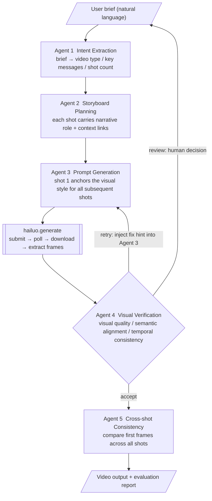

# AI Video Agent Workflow

[中文](README_CN.md)

Describe what you want to film in plain language — no prompt engineering required. The pipeline breaks it into shots, generates optimized prompts, and automatically verifies each one.

> **Note**: This is a learning project built for a Hailuo AI product manager application.
> The goal was to understand the real barriers in AI video generation by building, not just researching.
> The code runs end-to-end, but this is not a production tool.

---

## Background

The core barriers in AI video generation today:

- **Prompt gap**: Users have ideas but can't translate them into effective model instructions
- **Cross-shot amnesia**: Diffusion models have no cross-task memory — each shot is generated in isolation, causing subject drift between cuts
- **Opaque failure**: When generation fails, users have no feedback path and can only retry blindly

This creates an unpredictable "gacha-style" experience where success feels random. This pipeline addresses all three problems with a multi-agent workflow.

---

## Architecture



**Cross-shot consistency strategies:**
| Strategy | Mechanism | Best for |
|----------|-----------|----------|
| Narrative chaining | Last frame of shot N → first frame of shot N+1 | Story videos, continuous motion |
| Identity anchoring | Shot 1 first frame as global reference | Product videos, subject consistency |
| Independent | Each shot generated independently | Style montage, no continuity needed |

---

## Quickstart

**1. Install dependencies**
```bash
python -m venv .venv
source .venv/bin/activate
pip install -r requirements.txt
```

**2. Configure API keys**
```bash
cp .env.example .env
# Edit .env and add your Anthropic and MiniMax API keys
```

**3. Run**
```bash
python main.py
```

Enter a brief when prompted, for example:
```
Japanese pour-over coffee brand "Hairi", emphasizing craft and slow living.
4 shots: pouring close-up, crema swirl, morning table scene, brand close-out.
Japanese film aesthetic, warm tones, 30 seconds.
```

---

## File Structure

```
├── main.py          Entry point, orchestrates the full 5-agent pipeline
├── agents.py        Agent implementations and system prompts
├── hailuo.py        Hailuo API client (submit / poll / download / extract frames)
├── models.py        Core data models (Shot / Storyboard / EvalResult)
├── loading.py       Absurd loading messages during generation wait
├── requirements.txt Dependencies
└── .env.example     API key template
```

---

## Dependencies

- [Anthropic Claude API](https://docs.anthropic.com) — backbone model for all five agents
- [MiniMax Hailuo API](https://www.minimax.com) — video generation
- ffmpeg — frame extraction (must be installed locally)
