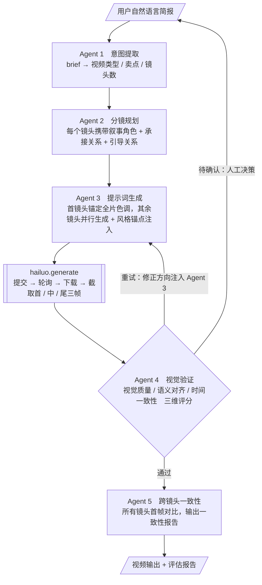

# Hailuo AI 视频提示词智能体

[English](README.md)

用自然语言说清楚你想拍什么，无需学提示词语法，自动拆解分镜、生成并验证每一个镜头。

> **说明**：这是一个学习实践项目，为 Hailuo AI 产品经理岗位申请而构建。
> 目的是通过动手理解 AI 视频生成的真实障碍，而不是停留在调研层面。
> 代码可运行，逻辑完整，但不是生产级工具。后续是否迭代取决于实际需要。

---

## 背景

目前 AI 视频生成的核心障碍包括：

- **提示词门槛**：用户有创意，但不知道怎么写提示词
- **跨镜头失忆**：扩散模型无跨任务上下文，每个镜头孤立生成导致主体漂移
- **失败不透明**：生成失败后没有反馈路径，用户只能盲目重试

导致「抽卡」式不稳定的用户体验。本项目通过智能体工作流解决这三个问题。

---

## 架构



**跨镜头一致性策略（生成层）：**
| 策略 | 机制 | 适用场景 |
|------|------|----------|
| 叙事衔接 | 上一镜头尾帧 → 下一镜头首帧 | 故事类，人物连续运动 |
| 身份锚定 | 镜头1首帧固定为全局参考 | 产品视频，主体一致性优先 |
| 独立生成 | 每个镜头独立 T2V | 风格拼贴，镜头间无关联 |

---

## 快速开始

**1. 安装依赖**
```bash
python -m venv .venv
source .venv/bin/activate
pip install -r requirements.txt
```

**2. 配置 API Key**
```bash
cp .env.example .env
# 编辑 .env，填入你的 Anthropic 和 MiniMax API Key
```

**3. 运行**
```bash
python main.py
```

按提示输入业务简报，例如：
```
日式手冲咖啡品牌"焙日"，强调手工感和慢生活。
需要4个镜头：手冲特写、咖啡油脂旋转、晨光木桌、品牌收尾。
日系胶片感，暖黄色调，30秒。
```

---

## 文件结构

```
├── main.py          主入口，编排五个 Agent 的完整流程
├── agents.py        五个 Agent 的实现与系统提示词
├── hailuo.py        Hailuo API 封装（提交 / 轮询 / 下载 / 截帧）
├── models.py        核心数据模型（Shot / Storyboard / EvalResult）
├── loading.py       等待期间的进度提示
├── requirements.txt 依赖列表
└── .env.example     API Key 配置模板
```

---

## 依赖

- [Anthropic Claude API](https://docs.anthropic.com) — 五个智能体的底层模型
- [MiniMax Hailuo API](https://www.minimax.com) — 视频生成
- ffmpeg — 视频截帧（需本地安装）
